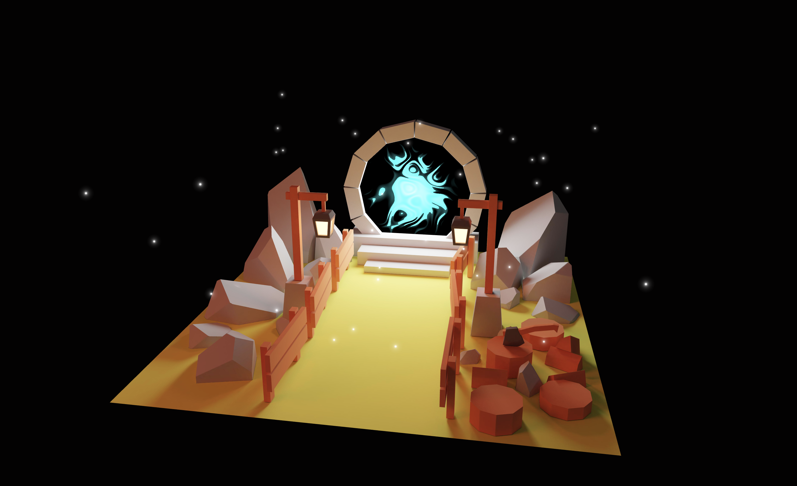

<h1 align="center">
<br>
Portal Scene
<br>
</h1>
<h4 align="center">Made with Blender and Three.js</h4>



## Run the App
**Clone the repository**:
```sh
git clone https://github.com/elizanierwinska/Portal-scene.git
```

**Install all the dependencies:**<br>
npm
```sh
npm install 
```
yarn
```sh
yarn install
```
pnpm
```sh
pnpm install
```

**In the project directory run**: 
```sh
npm run dev
```

This will run the application in the development mode.


## Information about the project

Portal scene is a project created with Blender and Three.js library. Scene was created in blender, baked and then exported and rendered with Three.js.

## This project was built with:
* Blender
* Three.js
